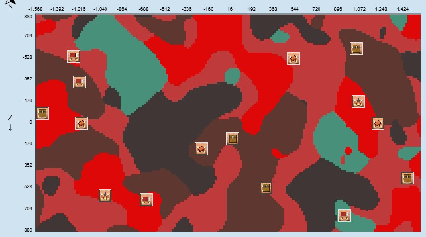

# Untitled Minecraft Server 信息公示

坐标表示：

- 二元组 (x, z)
- 三元组 (x, y, z)

## chunkbase

### 结构

#### 村庄

- 西热带草原村庄 (-192, -240)
- 东热带草原村庄 (80, -160)
- 平原村庄 (272, 112)
- 西北前哨站旁村庄 (-1024, -928)
- 樱花村庄 (-1888, -1584)

#### 末地要塞

- 传送门房间 (-180, 37, -1979)

#### 掠夺者前哨站

- 沿东南海前哨站 (2112, 352)
- 西北内陆前哨站 (-784, -1024)

#### 末地城（打钩或星号*代表鞘翅还在）

- [ ] (1336, 744)
- [ ] (440, 1032)
- [ ] (2008, 376)
- [ ] (2312, 712)
- [x] *(1064 1368)
- [ ] (392, 1688)

#### 远古城市

- (-1128, -51, -1416)

#### 猪灵堡垒

如图

#### 海底神殿

- (1208, 1352)
- (1656, 1144)

### 群系

#### 沙漠

- (-800, 250)

#### 海洋

- 东南海 (1800, 750)
- 南海 (700, 1500)

#### 樱花树林

- 大樱花林 (-1000, -1300)
- 小樱花林 (-480, -1180)
- 村庄樱花林 (-1800, -1600)
- 东北樱花林 (1600, -2900)

## 基地

- 东热草村庄基地 (77, 64, -227)
    - zhdbk
    - DingerBtn
    - Altria
    - poison4046184
- 西热草村庄基地 (-182, 105, -216)
    - AwfulLime473897
- 平原村庄基地 (279, 69, 124)
    - yi985
- 樱花村庄基地 (-1827, 124, -1588)
    - zhdbk
    - DingerBtn

## 地狱交通

### 节点

坐标表示：主世界坐标 / 地狱坐标

- 中心节点群 - / (6, 67, -29)
    - 出生点 (51, 64, -4) / (3, 68, -6)
    - 东热草村庄基地 (77, 64, -227) / (3, 65, -34)

      ~~:warning: 此节点有区块加载器，停机会造成较大损失！若不慎被恶魂炸毁请立即通知zhdbk！~~ 已损坏
    - 西热草村庄基地 (-182, 105, -216) / (-10, 67, -16)
    - 平原村庄基地 (279, 69, 124) / (34, 70, 15)
- 末地要塞 (-180, 37, -1979) / (-21, 72, -249)
- 沙漠 (-800, 72, 250) / (-101, 63, 30)
- 西北内陆前哨站 (-835, 63, -913) / (-105, 68, -116)
- 远古城市 (-1129, -42, -1421) / (-152, 38, -192)
- 樱花村庄基地 (-1827, 124, -1588) / (-225, 75, -197)

### 线路

- 中心节点群 <--铁路==
    - --> 末地要塞
    - --> 西北内陆前哨站
- 中心节点群 <--铁路--> 沙漠
- 西北内陆前哨站 <--铁路==
    - --> 远古城市
    - --> 樱花村庄

## 全服公有财产

- 东热草村庄基地 (77, 64, -227)
    - ~~刷铁机 (66, 64, -221)~~ 已损坏
    - 自动瓜田 (44, 62, -226)
    - 梯田 (48, 75, -182)

欢迎补充！

---

##### 仓库

[https://github.com/Tom4716/UntitledServerRule](https://github.com/Tom4716/UntitledServerRule)
